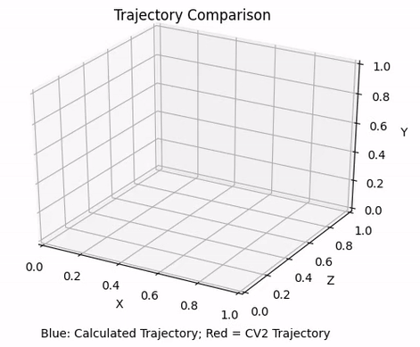

# Visual Odometry for Autonomous Systems

## Introduction

Visual odometry is the process of determining the position and orientation of a robot by analyzing the associated camera images. That is, the 2D representations allow us to extract 3D information about where the camera is and in which direction the robot moves.

For this project, we are provided with a set of camera frames obtained from a camera planted in a moving car and from this data we are required to find the position and orientation of the camera through a SfM pipeline and finally provide the plot of the trajectory of the camera.

The outputs and approach is mentioned in the report [here](https://github.com/kmushty/Visual_Odometry/blob/main/report.pdf)

## Dependencies

The following are the project dependencies:
- OpenCV 3.4.2 or above
- Python 3.5
- Oxford Dataset

## Code Execution

In order to implement the code:
- Clone the repo
- Run using the following command in the command line ``python3 visual_odometry.py``
- Run the code with the oxford dataset and create a new folder Dataset and extract the files to the folder
- The outputs for the code will be shown as 2D, 3D pose plots along with the matrix outputs.

## Outputs

